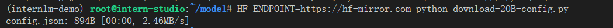

## 基础作业：

1.使用 InternLM-Chat-7B 模型生成 300 字的小故事


2.熟悉 hugging face 下载功能，使用 `huggingface_hub` python 包，下载 `InternLM-20B` 的 config.json 文件到本地

首先安装依赖


```python
#创建download-20B-config.py文件
import os 
from huggingface_hub import hf_hub_download  # Load model directly 

hf_hub_download(repo_id="internlm/internlm-20b", filename="config.json")

#运行后出现'Cannot connect to proxy.', TimeoutError('timed out'))等错误，应该是网络代理的问题。
#使用以下命令，利用镜像网站下载即可
HF_ENDPOINT=https://hf-mirror.com python download-20B-config.py
```



## 进阶作业：

灵笔的图文理解


完成 Lagent 工具调用


