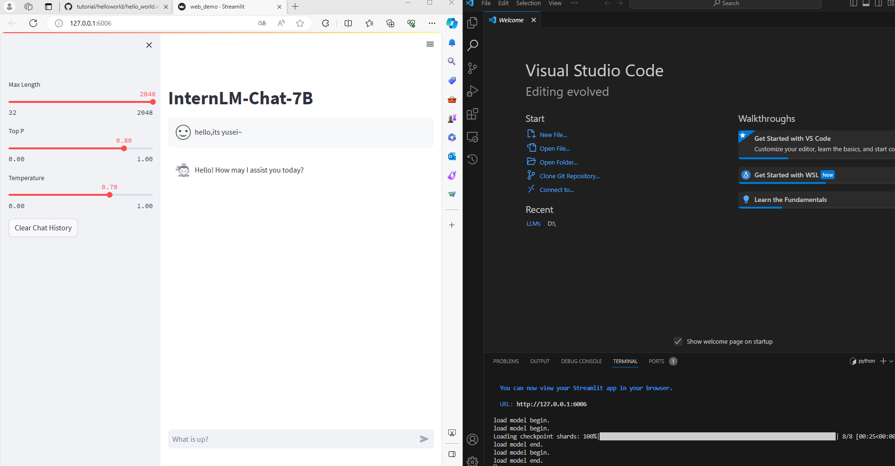
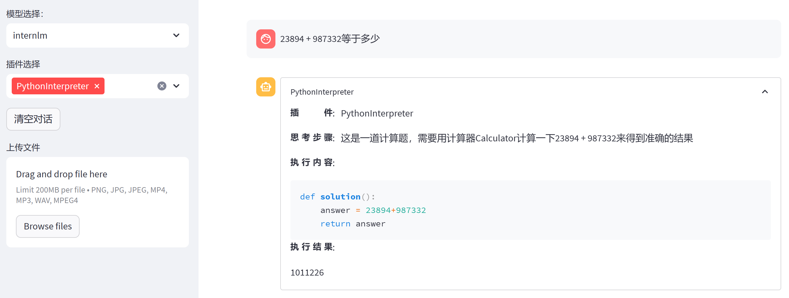
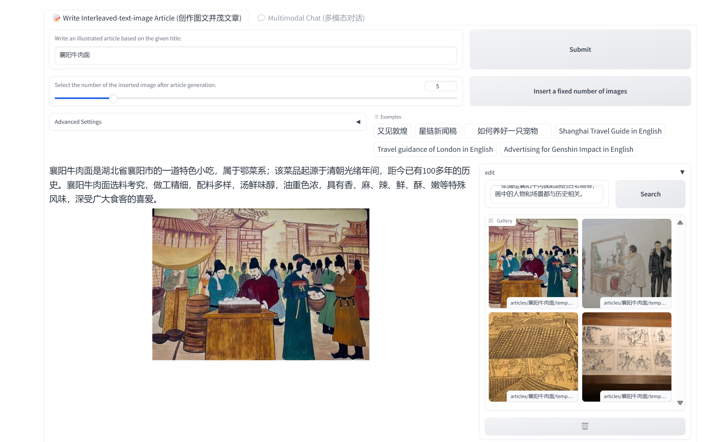
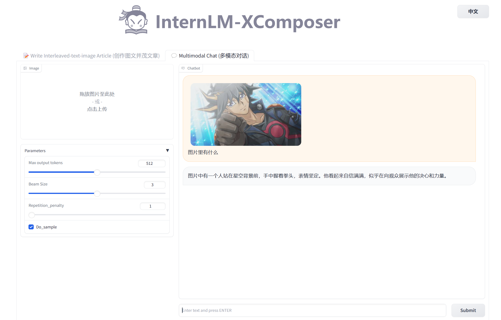
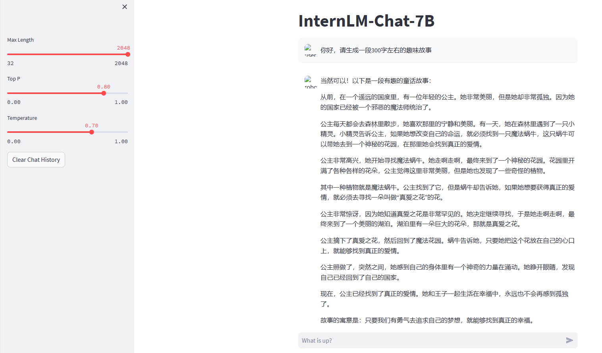
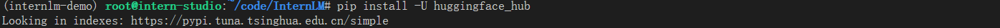
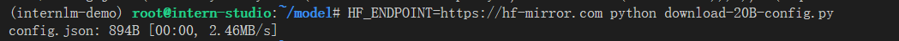

# 书生·浦语大模型实战-2

## 2. 对话Demo

### 2.1 环境准备与配置

终端输入bash，进入 `conda` 环境之后，使用以下命令从本地克隆一个已有的 `pytorch 2.0.1` 的环境

```python
bash # 请每次使用 jupyter lab 打开终端时务必先执行 bash 命令进入 bash 中
conda create --name internlm-demo --clone=/root/share/conda_envs/internlm-base
#之后每次进入就输入bash进入bash中
#激活环境
conda activate internlm-demo
```

首先配置本地端口

```python
由于之前已经生成过本地的ssh key，这里查看即可
cat ~\.ssh\id_rsa.pub
#将ssh key复制到开发机的配置中,保存添加即可
#点击SSH登录,复制该命令到本地终端，成功连接

#按照教程激活环境后安装运行demo所需要的依赖

# 升级pip
python -m pip install --upgrade pip

pip install modelscope==1.9.5
pip install transformers==4.35.2
pip install streamlit==1.24.0
pip install sentencepiece==0.1.99
pip install accelerate==0.24.1

```

### 2.2  模型下载

```python
mkdir -p /root/model/Shanghai_AI_Laboratory
cp -r /root/share/temp/model_repos/internlm-chat-7b /root/model/Shanghai_AI_Laboratory
```

### 2.3 代码准备

```python
#在/root下面新建code目录,进入code目录 clone代码
cd /root/code
git clone https://gitee.com/internlm/InternLM.git

#切换commit版本
cd InternLM
git checkout 3028f07cb79e5b1d7342f4ad8d11efad3fd13d17

#将 /root/code/InternLM/web_demo.py中 29 行和 33 行的模型更换为本地的 /root/model/Shanghai_AI_Laboratory/internlm-chat-7b。
```

### 2.4 终端运行

```python
#在/root/code/InternLM新建一个 cli_demo.py 文件,填入：
import torch
from transformers import AutoTokenizer, AutoModelForCausalLM


model_name_or_path = "/root/model/Shanghai_AI_Laboratory/internlm-chat-7b"

tokenizer = AutoTokenizer.from_pretrained(model_name_or_path, trust_remote_code=True)
model = AutoModelForCausalLM.from_pretrained(model_name_or_path, trust_remote_code=True, torch_dtype=torch.bfloat16, device_map='auto')
model = model.eval()

system_prompt = """You are an AI assistant whose name is InternLM (书生·浦语).
- InternLM (书生·浦语) is a conversational language model that is developed by Shanghai AI Laboratory (上海人工智能实验室). It is designed to be helpful, honest, and harmless.
- InternLM (书生·浦语) can understand and communicate fluently in the language chosen by the user such as English and 中文.
"""

messages = [(system_prompt, '')]

print("=============Welcome to InternLM chatbot, type 'exit' to exit.=============")

while True:
    input_text = input("User  >>> ")
    input_text.replace(' ', '')
    if input_text == "exit":
        break
    response, history = model.chat(tokenizer, input_text, history=messages)
    messages.append((input_text, response))
    print(f"robot >>> {response}")
    
#在终端运行： 
python /root/code/InternLM/cli_demo.py


```

### 一些问题：

第一次成功了,可以用英文正常对话。但是聊了两句后,换成中文,突然就退出了。多试几次后面并没有出问题,有点奇怪。

### 2.5 web demo

```python
#切换到vs code中 激活环境 运行 /root/code/InternLM目录下的web_demo.py文件，之前已经将端口映射到本地,在本地浏览器输入http://127.0.0.1:6006即可

bash
conda activate internlm-demo  # 首次进入 vscode 会默认是 base 环境，所以首先切换环境
cd /root/code/InternLM
streamlit run web_demo.py --server.address 127.0.0.1 --server.port 6006 #运行web_demo

```



可以成功进行聊天~


## 3. Lagent智能体工具调用demo

之前已经配置好了环境,这里直接安装lagent即可

```python
#首先切换路径到 /root/code 克隆 lagent 仓库，并通过 pip install -e . 源码安装 Lagent

cd /root/code
git clone https://gitee.com/internlm/lagent.git
cd /root/code/lagent
git checkout 511b03889010c4811b1701abb153e02b8e94fb5e # 尽量保证和教程commit版本一致
pip install -e . # 源码安装

#替换/root/code/lagent/examples/react_web_demo.py 的代码，运行：
streamlit run /root/code/lagent/examples/react_web_demo.py --server.address 127.0.0.1 --server.port 6006


```



### 注意：

点进 http://127.0.0.1:6006 后选择模型：internlm模型才进行加载，可能加载的比较久。

加载完毕后不会像web_demo出现load model end.的提示，可以自行输入一些数学问题查看是否加载完毕，模型的回答较慢，需要多等待一下。

## 4.浦语·灵笔图文理解创作 Demo

### 4.1 配置

升级双卡

```python
conda create --name xcomposer-demo --clone=/root/share/conda_envs/internlm-base #创建新的conda环境用于该项目
conda activate xcomposer-demo #激活新环境
pip install transformers==4.33.1 timm==0.4.12 sentencepiece==0.1.99 gradio==3.44.4 markdown2==2.4.10 xlsxwriter==3.1.2 einops accelerate #下载相关的包

```

### 4.2 模型下载

```python
mkdir -p /root/model/Shanghai_AI_Laboratory
cp -r /root/share/temp/model_repos/internlm-xcomposer-7b /root/model/Shanghai_AI_Laboratory
```

### 4.3 代码准备

```python
cd /root/code
git clone https://gitee.com/internlm/InternLM-XComposer.git
cd /root/code/InternLM-XComposer
git checkout 3e8c79051a1356b9c388a6447867355c0634932d  # 最好保证和教程的 commit 版本一致
```

### 4.4 Demo 运行

```python
#终端运行
cd /root/code/InternLM-XComposer
python examples/web_demo.py  \
    --folder /root/model/Shanghai_AI_Laboratory/internlm-xcomposer-7b \
    --num_gpus 1 \
    --port 6006


#这里 num_gpus 1 是因为InternStudio平台对于 A100(1/4)*2 识别仍为一张显卡。但如果有小伙伴课后使用两张 3090 来运行此 demo，仍需将 num_gpus 设置为 2 。

```

创作文章



多模态对话：




## 基础作业：

1.使用 InternLM-Chat-7B 模型生成 300 字的小故事



2.熟悉 hugging face 下载功能，使用 `huggingface_hub` python 包，下载 `InternLM-20B` 的 config.json 文件到本地



```python
#创建download-20B-config.py文件
import os 
from huggingface_hub import hf_hub_download  # Load model directly 

hf_hub_download(repo_id="internlm/internlm-20b", filename="config.json")

#运行后出现'Cannot connect to proxy.', TimeoutError('timed out'))等错误，应该是网络代理的问题。
#使用以下命令，利用镜像网站下载即可
HF_ENDPOINT=https://hf-mirror.com python download-20B-config.py
```



进阶作业如笔记所示


